# ⚙️ Gear fix
Deskpot application developed in WPF, сreated to help people who are not familiar with cars, as well as beginner mechanics, so that they can quickly identify possible diagnoses. Third-party APIs have been integrated into the application, such as: Gemini API, API NHTSA, 2ГИС API. The app also allows you to add and edit records about the user's vehicle and any malfunctions it may have. All app data is stored in an encrypted JSON file locally on the user's computer. Encryption in the app is performed using AES-GCM technology, with the hash key derived from the password, which is then passed to the Argon2 algorithm.
> [!WARNING]
> It's recommended to enable VPN before launching the app for users located in restricted countries. If this doesn't apply to you, you can ignore this section.
***
## 🛠️ Stack
  ### 🗣️ Languages
    - C# 14 / .NET 10
    - JavaScript (ESMAScript 2025)
    - CSS3
    - HTML5 
  ### 🎞️ Frameworks
    - WPF (latest on 20.07.2026)
  ### 📚 Libraries
    - Leaflet.js (maps | latest on 20.07.2026)
    - CommunityToolkit.MVVM (8.4.2)
    - Microsoft.Extensions.DependencyInjection (10.0.9)
    - Konscious.Security.Cryptography.Argon2 (1.3.1)
    - Microsoft.Web.WebView2 (1.0.4022.49)
    - System.Text.Json
  ### 🏗️ Architecture
    - MVVM Pattern
    - Repository Pattern
    - DTO Pattern
    - Dependency Injections
  ### 📱 Integrated API 
    - Google Gemini API
    - NHTSA API
    - 2ГИС API
  ### 🗃️ Data management
    - Json
    - LINQ
***
## ⏳ Implementation process
At start I prepared models, that will be use in the future. Set up them and connected with each other (added relationships). But I didn't know how to work with     APIs, so I haden't implemented models fot it (for now).

Then I started implementing services for password hashing, data encryption, and file handling. When I had done that, I decided to create one service that would join them (ManageDataService).

Afterwards, I began studying APIs: how to work with them and what needed to be done to use them in my application. Then, I developed models for working with the APIs I needed.

Next, I developed the login and registration windows. I linked the windows to their View Models, which already contained the IManageDataService interface.

The next step was to create the application's main menu, where the user would have access to all CRUD operations related to their vehicle card.

After the main menu, I began developing the diagnostics window. This required setting up a connection with the Google Gemini API, creating a field with instructions for the AI ​​advisor, and connecting to the official NHTSA (National Highway Traffic Safety Administration) API. Next, I designed a window with a list of errors sent by the AI ​​advisor in a special JSON format.

After the diagnostics window, I decided to add the ability to change the password and API key, in case the user's password was stolen or the user simply decided to change their API key. I also decided to add the ability to delete the main application file, which stores all of the user's confidential information.

Finally, I decided to add a local map to the app. I decided to use a ready-made map from the Leaflet.js library, but it only worked in the browser, so I integrated a separate component: WebView via a Microsoft library. To retrieve workshop data, I decided to use the 2GIS API, as they offer free access to their databases for one month through a demo API key.

To connect the browser component with my desktop application, I developed a separate JavaScript file that sends POST requests via WebView to the application, which I process in the application. This JavaScript file also receives requests from my application using WebView commands and executes the corresponding commands. The request looks like this:
```csharp
  await _webView.CoreWebView2.ExecuteScriptAsync($"showUserLocation({correctLat}, {correctLon}, {radiusKm})");
```
At the end of development, minor bugs and errors were fixed, after which manual testing was completed.
***
## 💭 How can it be improved?
- Add AI from various organizations (Claude, GPT, Grok);
- Connect more free databases containing information about vehicle malfunctions and repairs;
- Add the ability to attach various files to the request field (photos, audio messages);
- Add a route plotting function to the nearest service station to the map;
- Add the ability to change the application theme.
***
## 📖 What I learned
- Work with third-party APIs;
- Create complex projects;
- Work with the WebView component;
- Correctly write instructions to an AI agent;
- Improved understanding of the project structure.
***
## 🚀 How to run it
1. Copy the repository to your computer (git clone "https://github.com/T-two-K/gear-fix.git" or download ZIP).
2. If you have Visual Studio click to the file GearFix.csproj and then use shortcut "Ctrl + f5", if you don't have then open powershell (or other command line) and enter the following commands:
```powershell
  winget install Microsoft.DotNet.SDK.10
  cd gear-fix #(or full path to this folder, for example: C:/Users/user123/gear-fix)
  dotnet restore
  dotnet build
  dotnet run
```
***
## 💡 How to use it
After launch, a password creation window will be displayed. The password will protect the user's API keys and vehicle data from third-party access.
<div align="center">
  <h3>Create password window</h3>
  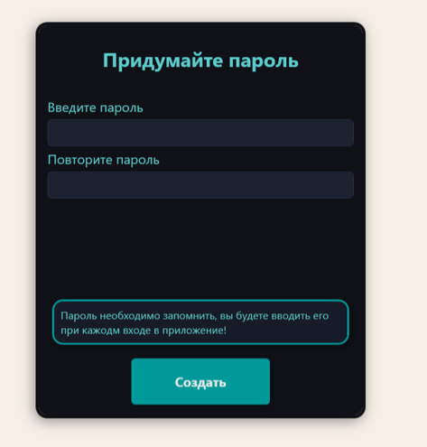
</div>
<br/>
Below is a login window, it will be displayed if the user has already created a password and re-launched the application.
<div align="center">
  <h3>Login window</h3>
  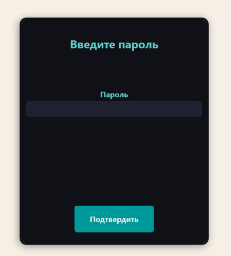
</div>
<br/>
Regardless of which window the user navigates from (the creation window or the password entry window), the API key entry window will appear if the API key hasn't been entered previously. Otherwise, the window won't appear. This API key is required for the AI ​​consultant to function correctly.
<div align="center">
  <h3>Enter API key window</h3>
  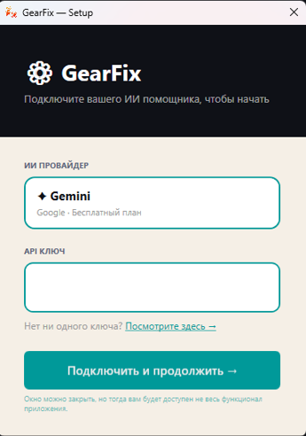
</div>
<br/>
To quickly find the required API key, there's a "View here" link on the form. Clicking this opens the official Google website, which displays the API keys for Gemini (this key will not be available in the CIS region; a VPN must be enabled for proper access). This key must be copied and pasted into the appropriate field. To save the key and gain access to the AI ​​consultant, click "Connect and continue." You don't have to enter the API key; simply close the window. However, doing so will limit access to the AI ​​consultant. The key can always be changed in the settings window.
After entering and confirming the API key, or by simply closing the API key entry window, the user will be greeted with the application's main menu.
<div align="center">
  <h3>Main menu window</h3>
  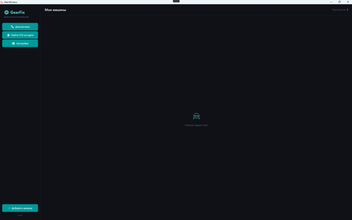
</div>
<br/>
In the app's main window, users can add, delete, and edit their vehicle records. To add a vehicle to the vehicle list, click the "Add Vehicle" button. A dialog box for creating a vehicle record will then appear.
<div align="center">
  <h3>Edit car info window</h3>
  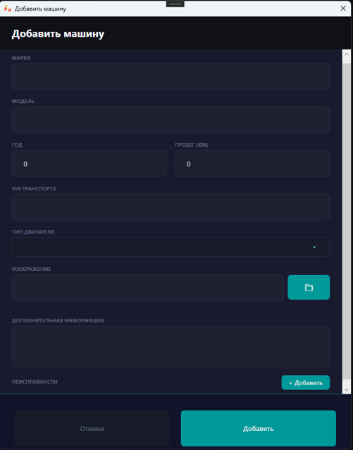
</div>
<br/>
To successfully create a record, you must fill in the required fields: "Make," "Model," and "Year." The remaining fields are optional, as the user desires to receive the most accurate diagnosis from the AI ​​consultant. The "Image" field serves a decorative purpose and is intended to visually display the vehicle's profile in the main menu. In this window, the user can also add, delete, and edit records of any vehicle malfunctions throughout its lifetime. The window for editing and adding malfunctions is shown below.
<div align="center">
  <h3>Edit malfunction window</h3>
  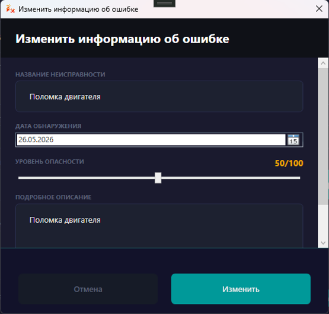
</div>
<br/>
To successfully add a new malfunction, you must fill in the fields with the name and brief description of the malfunction, as well as correctly indicate the malfunction date.
After filling in all the required fields and clicking the "Add" button, the vehicle card with brief information about the vehicle will appear in the main menu.
<div align="center">
  <h3>Car card</h3>
  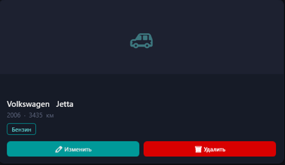
</div>
<br/>
By clicking on the vehicle card, the user will see a window with detailed information about the selected vehicle.
<div align="center">
  <h3>View car info window</h3>
  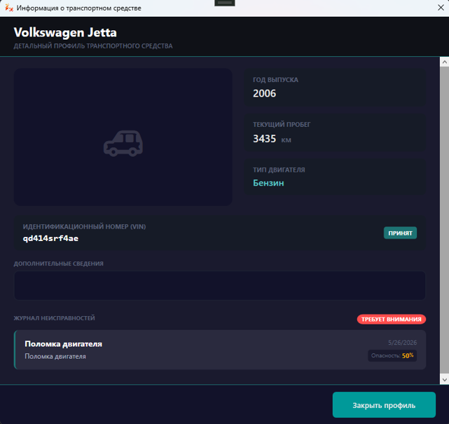
</div>
<br/>
When you click the "Diagnostics" button, a dialogue window with an AI consultant will open in front of the user.
<div align="center">
  <h3>Diagnostic window</h3>
  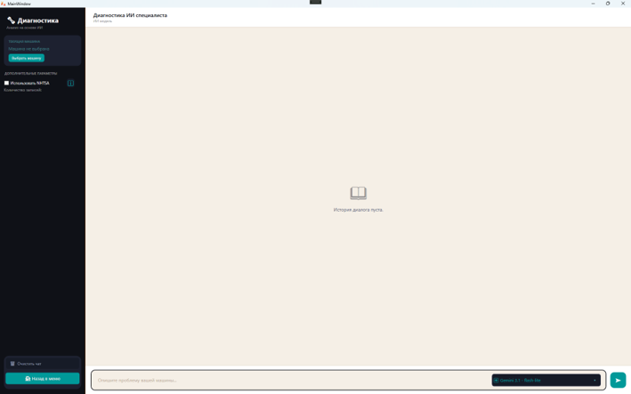
</div>
<br/>
Before communicating with the AI, you must select the vehicle you want to diagnose. You can then select "Use NHTSA," which increases the chance of an accurate diagnosis (valid only if at least one record is found). Next, you can select the model for which you want to receive advice, then enter your symptoms in the query field and submit them. If the model has sufficient data, it will return a special response with suggested diagnoses. For detailed diagnosis information, click the "View Diagnosis" button.
<div align="center">
  <h3>AI answer card</h3>
  
</div>
<br/>
After clicking the "View Diagnosis" button, the user will see a window with a description of the possible malfunctions that could occur with the user's machine.
<div align="center">
  <h3>Diagnos list window</h3>
  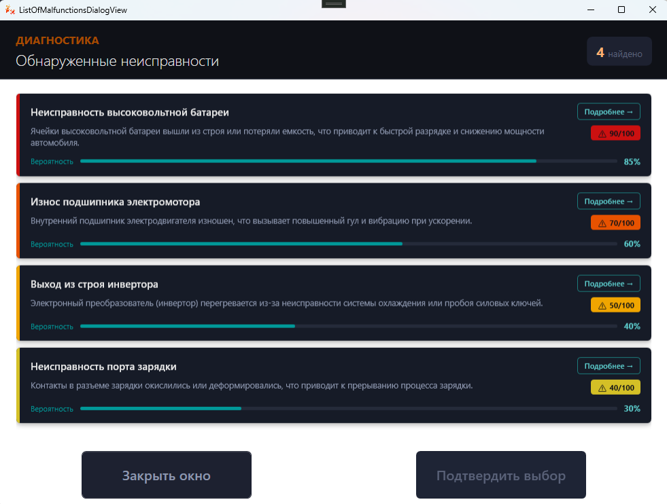
</div>
<br/>
Here you can see the probability, danger, name, and brief description of the suspected malfunction. The user can also select one of the malfunctions and click the "Confirm Selection" button; in this case, another error entry will be added to the vehicle's list of malfunctions. For more detailed information about the malfunction, click the "More Details" button, which will open a window with detailed information about the error.
<div align="center">
  <h3>Detailed diagnos info window</h3>
  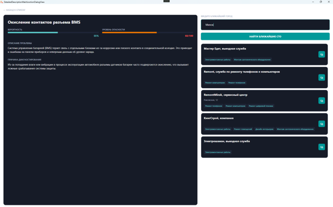
</div>
<br/>
In this window, you can also see why the AI ​​consultant suggested a particular problem, and you can also enter the nearest city to the user to quickly find the appropriate service centers that can resolve the issue.
Return to the main menu. Clicking the "Find a service station on the map" button will open a map window where you can find service stations and other car repair and diagnostic facilities using the search bar.
<div align="center">
  <h3>Map window</h3>
  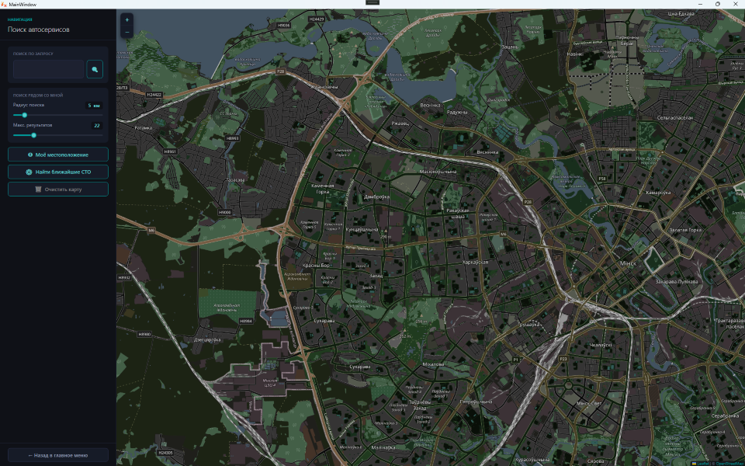
</div>
<br/>
Users can also find auto repair shops, service stations, tire shops, and other auto repair locations near them. To do this, they can locate themselves on the map by tapping the "My Location" button. If the user's device doesn't have geolocation access, the app allows them to manually specify their estimated location. Using the "Search Radius" and "Max Results" sliders, they can select the search radius and number of service stations around the specified location. The "Clear Map" button removes all markers from the map.
Tapping the "Settings" button displays a settings window where they can change their API key, password, or delete all app data.
<div align="center">
  <h3>Settings window</h3>
  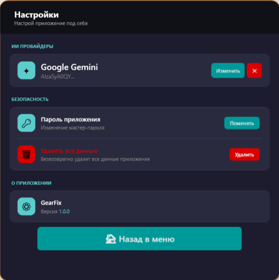
</div>
<br/>
When attempting to change the password, the user will be asked to enter the current password and a new one, which will be used for subsequent login attempts.
<div align="center">
  <h3>Change password window</h3>
  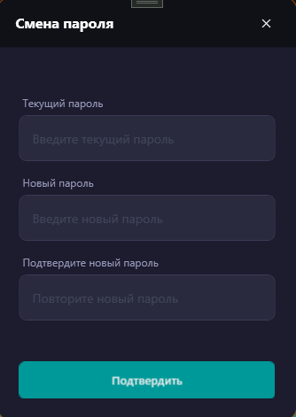
</div>
<br/>
To close the application, click on the cross in the upper right corner of the main window.
